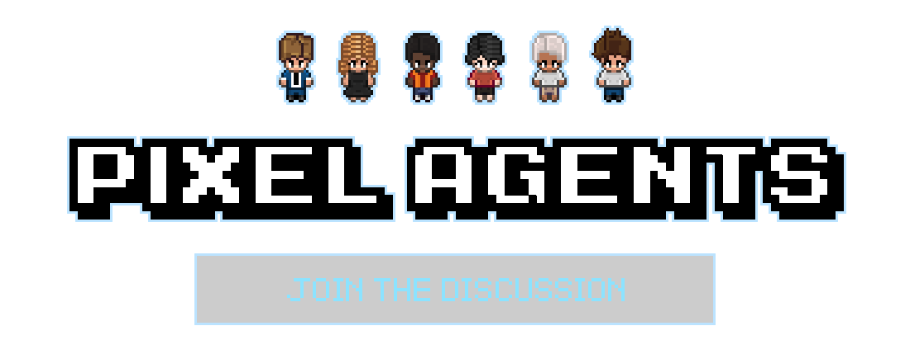

<h1 align="center">
    <a href="https://github.com/pixel-agents-hq/pixel-agents/discussions">
        
    </a>
</h1>

<h2 align="center" style="padding-bottom: 20px;">
  Lightory: Pixel Agents for OpenCode
</h2>

<div align="center" style="margin-top: 25px;">

[](https://github.com/pixel-agents-hq/pixel-agents/releases)
[](https://marketplace.visualstudio.com/items?itemName=pablodelucca.pixel-agents)
[](https://github.com/pixel-agents-hq/pixel-agents/stargazers)
[](https://github.com/pixel-agents-hq/pixel-agents/blob/main/LICENSE)
[](https://github.com/pixel-agents-hq/pixel-agents/issues?q=is%3Aopen+is%3Aissue+label%3A%22good+first+issue%22)

</div>

<div align="center">
<a href="https://marketplace.visualstudio.com/items?itemName=pablodelucca.pixel-agents">🛒 VS Code Marketplace</a> • <a href="https://github.com/pixel-agents-hq/pixel-agents/discussions">💬 Discussions</a> • <a href="https://github.com/pixel-agents-hq/pixel-agents/issues">🐛 Issues</a> • <a href="CONTRIBUTING.md">🤝 Contributing</a> • <a href="CHANGELOG.md">📋 Changelog</a>
</div>

<br/>

## Lightory OpenCode Fork

Lightory is an OpenCode-focused fork of Pixel Agents. It turns AI coding sessions
into something you can see and manage: each agent becomes a character in a pixel
art office, with live status for tool use, permissions, and idle/waiting states.

This fork currently targets standalone desktop/browser use:

- **Browser Web UI** - `node dist/cli.js --provider opencode` starts a local
  Fastify server and serves the office at `http://127.0.0.1:3100`.
- **OpenCode plugin hooks** - `.opencode/plugins/pixel-agents-opencode.ts`
  forwards OpenCode session, tool, permission, and idle events into the local
  server.
- **Desktop shell-ready** - `desktop-shell/contract.ts` reserves the
  process/WebView boundary for a future Tauri or Electron wrapper.

IDE WebView and TUI surfaces are intentionally out of scope for this fork's
first phase. Mobile and pad apps are treated as separate product surfaces; see
[docs/mobile-pad-app-design.md](docs/mobile-pad-app-design.md).

## Upstream

This project is based on
[pixel-agents-hq/pixel-agents](https://github.com/pixel-agents-hq/pixel-agents).
The original project focuses on Claude Code and VS Code extension workflows.
This fork keeps the shared server/webview architecture and adds an OpenCode
hooks-only provider.

## Original Pixel Agents Overview

Pixel Agents turns multi-agent AI systems into something you can actually see and manage. Each agent becomes a character in a pixel art office. They walk around, sit at their desk, and visually reflect what they are doing — typing when writing code, reading when searching files, waiting when it needs your attention.

It ships in **two flavors from the same source tree**:

- **VS Code extension** — `pablodelucca.pixel-agents` on the [VS Code Marketplace](https://marketplace.visualstudio.com/items?itemName=pablodelucca.pixel-agents) and [Open VSX](https://open-vsx.org/extension/pablodelucca/pixel-agents). Agents spawn into VS Code terminals; characters render in the panel area.
- **Standalone CLI** — `npx pixel-agents` runs a local Fastify server and serves the office as a browser SPA. Useful in tmux workflows, remote sessions, or any environment without a desktop VS Code.

Internally, the architecture is fully agent-agnostic and platform-agnostic: a typed `HookProvider` interface defines the integration boundary so adding a new AI tool is a single subdirectory of code. Claude Code is the reference implementation today; Codex, Gemini, Cursor, and others are on the roadmap.


## Features

- **One agent, one character** — every Claude Code terminal gets its own animated character
- **Live activity tracking** — characters animate based on what the agent is actually doing (writing, reading, running commands)
- **Office layout editor** — design your office with floors, walls, and furniture using a built-in editor
- **Speech bubbles** — visual indicators when an agent is waiting for input or needs permission
- **Sound notifications** — optional chime when an agent finishes its turn
- **Sub-agent visualization** — Task tool sub-agents spawn as separate characters linked to their parent
- **Persistent layouts** — your office design is saved and shared across VS Code windows
- **External asset directories** — load custom or third-party furniture packs from any folder on your machine
- **Diverse characters** — 6 diverse characters. These are based on the amazing work of [JIK-A-4, Metro City](https://jik-a-4.itch.io/metrocity-free-topdown-character-pack).

<p align="center">
  
</p>

## Requirements

- Node.js and npm
- [OpenCode](https://opencode.ai/) installed and configured
- **Platform**: Windows, Linux, and macOS are supported
- Optional: VS Code 1.105.0 or later if you are working on the inherited
  extension surface

## Getting Started

### OpenCode standalone

```bash
git clone https://github.com/zarcherlot/lightory.git
cd lightory
npm install
npm run build:webview
node esbuild.js --production
node dist/cli.js --provider opencode --port 3100
```

Open `http://127.0.0.1:3100`.

For sessions launched inside this repository, OpenCode automatically loads the
project plugin at `.opencode/plugins/pixel-agents-opencode.ts`. For global use,
copy or symlink that plugin into your global OpenCode plugin directory.

### Development from source

```bash
git clone https://github.com/zarcherlot/lightory.git
cd lightory
npm install      # npm workspaces installs root + server + webview-ui in one shot
npm run build
```

The inherited VS Code extension development flow still exists for upstream
compatibility. Press **F5** in VS Code to launch the Extension Development Host.

To try the **standalone CLI** locally:

```bash
node dist/cli.js --provider opencode --port 3100
```

It starts the Fastify server and serves the webview SPA at
`http://127.0.0.1:3100`. Server discovery for hooks is written to
`~/.pixel-agents/server.json`.

### Browser Preview & Hosted Reports

The browser-preview version of the webview can be built and staged for Vercel separately from the VS Code extension build.

```bash
npm run test
npm run e2e
npm run e2e -- --attach-videos-on-success
npm run vercel:prepare
```

Run `npm run test:report` separately when you want the combined Allure report locally without preparing the full Vercel output.

The staged Vercel output serves the standalone webview at `/webview/` and the Linux Allure report at `/reports/allure/`, combining the `e2e`, `server`, and `webview` suites. The GitHub Actions deploy job expects `VERCEL_TOKEN`, `VERCEL_ORG_ID`, and `VERCEL_PROJECT_ID` secrets.

### Usage

1. Open the **Pixel Agents** panel (it appears in the bottom panel area alongside your terminal)
2. Click **+ Agent** to spawn a new Claude Code terminal and its character. Right-click for the option to launch with `--dangerously-skip-permissions` (bypasses all tool approval prompts)
3. Start coding with Claude — watch the character react in real time
4. Click a character to select it, then click a seat to reassign it
5. Click **Layout** to open the office editor and customize your space

## Layout Editor

The built-in editor lets you design your office:

- **Floor** — Full HSB color control
- **Walls** — Auto-tiling walls with color customization
- **Tools** — Select, paint, erase, place, eyedropper, pick
- **Undo/Redo** — 50 levels with Ctrl+Z / Ctrl+Y
- **Export/Import** — Share layouts as JSON files via the Settings modal

The grid is expandable up to 64×64 tiles. Click the ghost border outside the current grid to grow it.

### Office Assets

All office assets (furniture, floors, walls) are now **fully open-source** and included in this repository under `webview-ui/public/assets/`. No external purchases or imports are needed — everything works out of the box.

Each furniture item lives in its own folder under `assets/furniture/` with a `manifest.json` that declares its sprites, rotation groups, state groups (on/off), and animation frames. Floor tiles are individual PNGs in `assets/floors/`, and wall tile sets are in `assets/walls/`. This modular structure makes it easy to add, remove, or modify assets without touching any code.

To add a new furniture item, create a folder in `webview-ui/public/assets/furniture/` with your PNG sprite(s) and a `manifest.json`, then rebuild. The asset manager (`scripts/asset-manager.html`) provides a visual editor for creating and editing manifests.

To use furniture from an external directory, open Settings → **Add Asset Directory**. See [docs/external-assets.md](docs/external-assets.md) for the full manifest format and how to use third-party asset packs.

Characters are based on the amazing work of [JIK-A-4, Metro City](https://jik-a-4.itch.io/metrocity-free-topdown-character-pack).

## How It Works

Pixel Agents has provider-specific detection paths:

- **OpenCode hooks-only mode** - OpenCode plugin hooks POST events
  (`session.created`, `tool.execute.before`, `tool.execute.after`,
  `permission.asked`, `session.idle`, and related events) to
  `POST /api/hooks/opencode`. No transcript file is required.

- **Hooks mode** (preferred) — Claude Code's official Hooks API POSTs events (`SessionStart`, `PreToolUse`, `Notification`, `Stop`, etc.) to a local Fastify server (`POST /api/hooks/:providerId`). Instant, reliable. Server discovery via `~/.pixel-agents/server.json`.
- **Heuristic mode** (fallback) — Polls JSONL transcript files at `~/.claude/projects/<project-hash>/<session-id>.jsonl`. Used when hooks aren't installed.

A single `HookProvider.normalizeHookEvent(raw)` translates each CLI's hook payload into a canonical `AgentEvent`. The shared `AgentRuntime` dispatches on `AgentEvent.kind`, mutates `AgentStateStore`, and the broadcast layer translates state events into typed `ServerMessage` over the active transport.

The webview runs a lightweight game loop with canvas rendering, BFS pathfinding, and a character state machine (idle → walk → type/read). Everything is pixel-perfect at integer zoom levels. Game state lives in an imperative `OfficeState` class outside React; React components read from it during render but don't own the state.

No modifications to Claude Code are needed — Pixel Agents is purely observational.

## Tech Stack

Four-package monorepo, npm workspaces:

- **`core/`** — TypeScript-only protocol + interfaces (AsyncAPI 3.0 contract, `HookProvider`, `MessageTransport`, `StateAdapter`). Zero runtime side effects.
- **`server/`** — Fastify v5 (HTTP + WebSocket), Vitest. Owns `AgentRuntime`, `AgentStateStore`, `SessionRouter`, `DismissalTracker`, file watching, transcript parsing, providers. Ships the standalone CLI.
- **`.opencode/plugins/`** - Project-level OpenCode plugin that forwards
  OpenCode lifecycle events to the local server.
- **`desktop-shell/`** - Reserved interface for a future native WebView shell.
- **`adapters/vscode/`** — VS Code Extension API. Composes `core/` + `server/` for the desktop surface.
- **`webview-ui/`** — React 19, Vite, Canvas 2D. Transport-agnostic (`PostMessageTransport` in VS Code, `WebSocketTransport` in the browser).

Builds: esbuild (extension + CLI + hook scripts), Vite (webview SPA). Tests: Vitest (server + webview unit), Playwright (e2e against real VS Code + standalone Fastify).

## Known Limitations

- **Agent-terminal sync** — the way agents are connected to Claude Code terminal instances is not super robust and sometimes desyncs, especially when terminals are rapidly opened/closed or restored across sessions.
- **Heuristic-based status detection** — Claude Code's JSONL transcript format does not provide clear signals for when an agent is waiting for user input or when it has finished its turn. The current detection is based on heuristics (idle timers, turn-duration events) and often misfires — agents may briefly show the wrong status or miss transitions.
- **Linux/macOS tip** — if you launch VS Code without a folder open (e.g. bare `code` command), agents will start in your home directory. This is fully supported; just be aware your Claude sessions will be tracked under `~/.claude/projects/` using your home directory as the project root.

## Troubleshooting

If your agent appears stuck on idle or doesn't spawn:

1. **Debug View** — In the Pixel Agents panel, click the gear icon (Settings), then toggle **Debug View**. This shows connection diagnostics per agent: JSONL file status, lines parsed, last data timestamp, and file path. If you see "JSONL not found", the extension can't locate the session file.
2. **Debug Console** — If you're running from source (Extension Development Host via F5), open VS Code's **View > Debug Console**. Search for `[Pixel Agents]` to see detailed logs: project directory resolution, JSONL polling status, path encoding mismatches, and unrecognized JSONL record types.

## Where This Is Going

The long-term vision is an interface where managing AI agents feels like playing the Sims, but the results are real things built.

- **Agents as characters** you can see, assign, monitor, and redirect, each with visible roles (designer, coder, writer, reviewer), stats, context usage, and tools.
- **Desks as directories** — drag an agent to a desk to assign it to a project or working directory.
- **An office as a project** — with a Kanban board on the wall where idle agents can pick up tasks autonomously.
- **Deep inspection** — click any agent to see its model, branch, system prompt, and full work history. Interrupt it, chat with it, or redirect it.
- **Token health bars** — rate limits and context windows visualized as in-game stats.
- **Fully customizable** — upload your own character sprites, themes, and office assets. Eventually maybe even move beyond pixel art into 3D or VR.

For this to work, the architecture needs to be modular at every level:

- **Platform-agnostic**: VS Code extension today, Electron app, web app, or any other host environment tomorrow.
- **Agent-agnostic**: Claude Code today, but built to support Codex, OpenCode, Gemini, Cursor, Copilot, and others through composable adapters.
- **Theme-agnostic**: community-created assets, skins, and themes from any contributor.

We're actively working on the core module and adapter architecture that makes this possible. If you're interested to talk about this further, please visit our [Discussions Section](https://github.com/pixel-agents-hq/pixel-agents/discussions).

## Community & Contributing

Use **[Issues](https://github.com/pixel-agents-hq/pixel-agents/issues)** to report bugs or request features. Join **[Discussions](https://github.com/pixel-agents-hq/pixel-agents/discussions)** for questions and conversations.

See [CONTRIBUTING.md](CONTRIBUTING.md) for instructions on how to contribute.

Please read our [Code of Conduct](CODE_OF_CONDUCT.md) before participating.

## Supporting the Project

If you find Pixel Agents useful, consider supporting its development:

<a href="https://github.com/sponsors/pablodelucca">
  
</a>
<a href="https://ko-fi.com/pablodelucca">
  
</a>

## Star History

[](https://www.star-history.com/?repos=pixel-agents-hq%2Fpixel-agents&type=date&legend=bottom-right)

## License

This project is licensed under the [MIT License](LICENSE).
